# ChIP-seq analysis and visualization using Galaxy

## 0. Getting started

Log in or register on the Fred Hutch Galaxy server at [http://galaxy.fredhutch.org](http://galaxy.fredhutch.org).
Please use your `fredhutch.org` email address when you register.

If your current history isn't empty, create a new one by clicking the gear icon at the top of the history pane to open the *History options* menu and selecting *Create New*.


Next, click on the history name, which defaults to "Unnamed history", and give it a more memorable name. (You'll have to hit the return key to save it; you can't just click away.)


## 1. Importing data from a data library

The data we'll be using is from a *Drosophila melanogaster* ChIP-seq experiment described in [Conrad et al. (2012)](http://science.sciencemag.org/content/337/6095/742) (ENA accession: PRJEB3031).
The authors explain that acetylation of histone H4K16 was thought to mediate an increase in X-linked transcription in *Drosophila* males relative to females, but the mechanism was unclear.
The purpose of the experiment was to investigate this mechanism, in part by comparing RNA polymerase II (Pol II) occupancies between male and female flies as well as between the X chromosome and autosomes.

The sequences are 75 bp single-end reads from the input and Pol II ChIP samples obtained from female flies.
Each set of sequences has been reduced to 200,000 reads that map to chr2L and chrX.
The reads are in FASTQ format, which includes both the sequences and the per-base quality scores.

It's very important to note here that Galaxy uses two FASTQ formats: "fastq" and "fastqsanger".
These formats are related to the quality score format used in the FASTQ file.
The "fastq" format makes no guarantee as to the quality score format used in the file (there are at least three).
Most Galaxy tools can't infer the format of quality scores, and thus will not accept "fastq" datasets as valid input.
Instead, tools usually expect "fastqsanger" inputs, in which the quality scores are guaranteed to be in Sanger/Illumina 1.8+ format.

Our data is already in "fastqsanger" format, so we don't need to do anything before we proceed.
However, if you're ever dealing with data in "fastq" format, there's information on converting it to "fastqsanger" [on the Galaxy wiki](https://wiki.galaxyproject.org/Support#FASTQ_Datatype_QA).
There's also a very helpful [screencast](http://vimeo.com/galaxyproject/fastqprep) covering this issue as well as other basic FASTQ preparation steps.

Now we'll import the reads sequenced for this experiment from a shared data library into our history.
In the menu bar, navigate to *Shared Data > Data Libraries* and select the **ChIP-seq tutorial data** library.

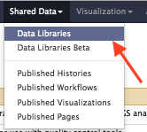

Tick the checkboxes next to the input and Pol II samples from female flies in the library to select them.
Make sure **Import to current history** is selected in the dropdown box at the bottom and then click *Go*.

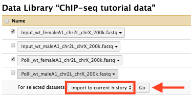

Return to the main Galaxy view by clicking *Analyze Data* in the menu bar.


## 2. Fetching gene annotations from UCSC

Next we'll fetch gene annotations for chromosomes 2L and X using the UCSC Table Browser.
This tool allows access to the same data available for visualization in the UCSC Genome Browser.


### 2a. Fetching the chr2L annotation

In the tool pane on the left-hand side, select *Get Data > UCSC Main*.
To download the annotation for chr2L, use the following settings:

* clade: **Insect**
* genome: **D. melanogaster**
* assembly: **Apr. 2006 (BDGP R5/dm3)**
* group: **Genes and Gene Predictions**
* track: **RefSeq Genes**
* region: (select **position**) **chr2L**
* output format: **BED - browser extensible data**

It should look like the following:

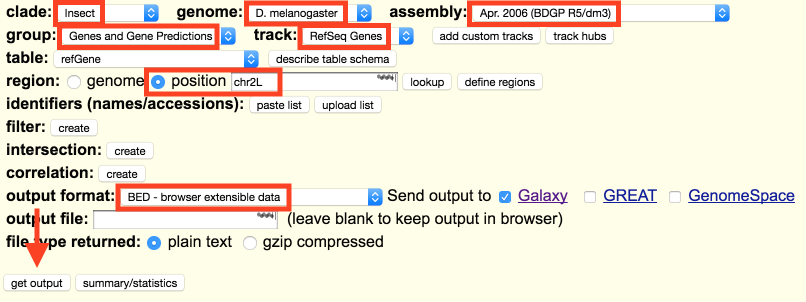

Once you're satisfied the settings are correct, click the *Get output* button near the bottom of the page.

The next page shows the options available for the records that will be returned in the BED file.
For example, if you were interested in the regions upstream of every RefSeq gene on chr2L, you would select the **Upstream by ___ bases** radio button and enter the length of the region you wanted.
In this case, though, we're interested in whole genes, so make sure **Whole Gene** is selected and then click *Send query to Galaxy* at the bottom of the page.

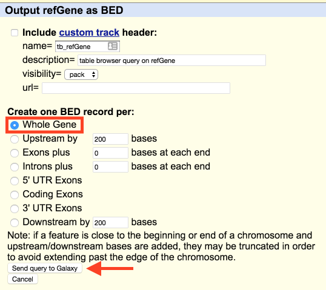

After a moment you'll be returned to the main Galaxy view and a new queued BED dataset will appear in your history.


### 2b. Fetching the chrX annotation

Again, in the tool pane on the left-hand side, select *Get Data > UCSC Main*.
The tool will remember the last settings you used, so you'll only need to change the position setting to **chrX** and click *Get output* then *Send query to Galaxy* again.

It's worth mentioning at this point that in most cases jobs can be configured and submitted even if the jobs they depend on are still queued or running &mdash; so you can continue on even if you're still waiting for the BED files to download.


### 2c. Combining the chr2L and chrX annotations

In a later step, we'll need the chr2L and chrX annotations combined into a single file.
BED files are plain-text tabular data with one row per feature, so to combine the chr2L and chrX annotations, we just need to concatenate them.
In the tool pane, select *Text Manipulation > Concatenate datasets*.
(You can also start typing "concatenate" into the search bar at the top of the tool pane to find the right tool.)

In the drop-down list, select the chr2L genes dataset you downloaded from UCSC Main.
Click the *Insert Dataset* button to add a second drop-down list, then select the chrX genes dataset.

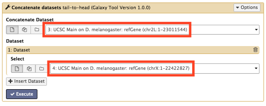

Finally, click the *Execute* button to submit the job.

The dataset name Galaxy assigns to the output of this job isn't very helpful, so we'll rename it before we continue.
Wait for the job to complete, then click the pencil icon next to the dataset name.

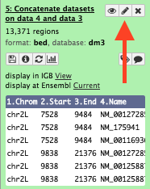

This will open the attributes pane.
In the "Name" text field at the top, type in a more memorable name, like **refGene (chr2L, chrX)**, then click *Save* at the bottom of the page.


## 3. Mapping reads with Bowtie2

[Bowtie2](http://bowtie-bio.sourceforge.net/bowtie2/index.shtml) is a fast and efficient tool for aligning short reads to long reference sequences.


### 3a. Mapping input sample reads

In the tool pane, select *NGS: Mapping > Bowtie2*.
Use the following settings:

* Is this library mate-paired? **Single-end**
* FASTQ file: **Input sample FASTQ file**
* Select a reference genome: **Fruit Fly (Drosophila melanogaster): dm3**

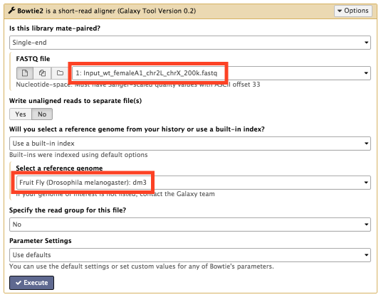

Then click *Execute* to submit the job.
This job will generate a sequence alignment (in BAM format) of the mapped input sample reads.


### 3b. Mapping Pol II sample reads

Follow the same steps as above, except for the following setting:

* FASTQ file: **Pol II sample FASTQ file**


### 3c. Renaming Bowtie2 output datasets

The names Galaxy gives the output datasets won't be very helpful later when we need to distinguish between the input and Pol II alignments.
As before, wait until the jobs complete, then click the pencil icon next to each Bowtie2 output dataset and give them more helpful names, like **Bowtie2 on Input_wt_femaleA1: aligned reads** and **Bowtie2 on PolII_wt_femaleA1: aligned reads**.


## 4. Examining Bowtie2's alignment summary

When you click on the name of a dataset in the history pane, it will expand to show more information.
Click on one of the Bowtie2 output datasets to expand it.
You'll notice some text in a box with some information about the alignment results, similar to the following:

```
[samopen] SAM header is present: 15 sequences.
200000 reads; of these:
  200000 (100.00%) were unpaired; of these:
    53 (0.03%) aligned 0 times
    191672 (95.84%) aligned exactly 1 time
    8275 (4.14%) aligned >1 times
99.97% overall alignment rate
```

It's a good idea to check this information before proceeding further to make sure it's reasonable.
Since this is tutorial data, the overall alignment rate will be abnormally high &mdash; between 60% and 90% is more typical of real data.
Also check the percentage of uniquely mapped reads (reads aligned exactly one time).
A low percentage of uniquely mapped reads may indicate a problem, but for some proteins may be unavoidable (e.g. if the protein binds frequently to repetitive DNA).
For the tutorial, if your overall alignment rate isn't over 99%, you may have aligned the reads to the wrong genome.

Note that only a few lines of tool output can be shown in this text box.
In this case, we only need to see a few lines, but other times you may need to inspect the full tool output.
To do so, first click the info icon under the text box.

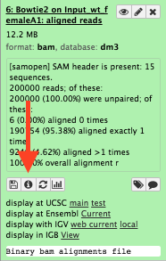

This will bring up the dataset information pane.
Here you'll see lots of information about this dataset and the job that created it, including the creation timestamp, size, format, tool name, and tool version.
The text we saw above comes from the messages the tool writes to what's called "standard error", or `stderr`.
Find the `stderr` link and click on it to display the entirety of these messages.

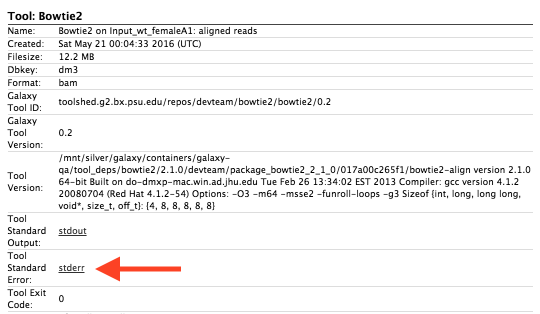

Some tools will write information to "standard output" (`stdout`) instead, or will write to both `stdout` and `stderr`.
Other tools don't output any messages at all, or maybe only do so when there's an error.
In any case, check here first if you're investigating a problem or looking for more information about a job.


## 5. Predicting fragment size

Before we can move on with the analysis, we need to know the average length of the DNA fragments from which the reads were sequenced.
Typically, reads sequenced from these fragments do not span their entire length.
The estimated fragment length is used to "extend" these reads to get a more accurate representation of the genomic regions covered by the sample.
(If you know the average fragment length based on the wet lab procedure, you can skip this step and use that value instead.)

This time we'll be using a tool outside the deepTools suite.
deepTools does provide a tool for estimating fragment length, but it only works with paired-end reads.
We'll use a tool from the MACS2 suite instead.

In the tool pane, select *NGS: Peak Calling > MACS2 predictd*.
In the "ChIP-seq alignment file" list at the top, select one of the Bowtie2 aligned reads datasets, then hold down Control (Windows) or Command (Mac) and select the other one.
Next, under "Effective genome size", select **Fly (121,400,000)**.
Leave the other settings at their defaults.

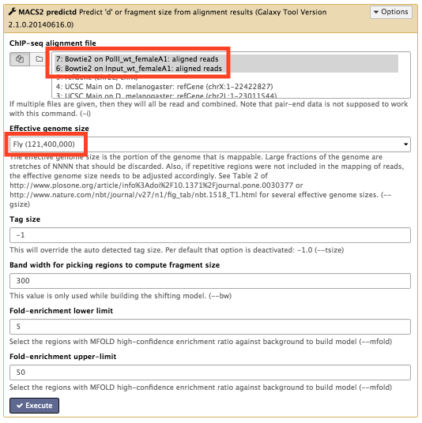

We'll need the predicted fragment size for the next step, so click *Execute* and wait for the job to finish.
The predictd tool produces two output datasets.
One, named "d value", is a text file containing the predicted fragment length.
The other, named "X-correlation image", is a PDF containing plots of the model from which the fragment length is predicted.
Click on the eye icon for the "d value" dataset to view it.

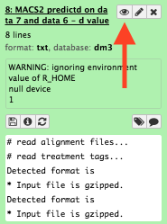

The predicted fragment length (as well as an alternate fragment length, in case the results are multimodal) is given at the bottom.


## 6. Computing sample correlation

Now we'll measure the degree of similarity between the input and Pol II samples.
The [bamCorrelate](https://github.com/fidelram/deepTools/wiki/QC#bamCorrelate) tool computes pairwise correlation coefficients between two or more BAM files based on read coverage over genomic regions.
The samples are then clustered hierarchically and the ordered table of coefficients is presented as a heatmap.

In the tool pane, select *NGS: deepTools > bamCorrelate*.
Use the following settings:

* 1: BAM files > Bam file: **Input sample aligned reads**
* 1: BAM files > Label: **Input**
* 2: BAM files > Bam file: **Pol II sample aligned reads**
* 2: BAM files > Label: **Pol II**
* Length of the average fragment size: **178**
* Correlation method: **Pearson**

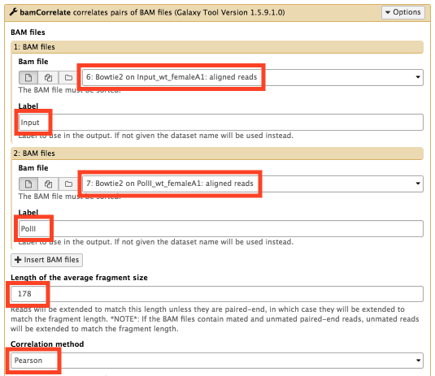

After setting the above parameters, click *Execute* to submit the job.

Using the Pearson correlation coefficient, values generally range from 0.3&ndash;0.4 for unrelated samples to &gt; 0.9 for high-quality replicates.


## 7. Plotting a ChIP-seq "fingerprint"

Next we'll assess the enrichment strength of the treated sample versus the control.
The [bamFingerprint](https://github.com/fidelram/deepTools/wiki/QC#bamFingerprint) tool generates a simple plot useful for determining whether or not the ChIP worked.

In the tool pane, select *NGS: deepTools > bamFingerprint*.
Use the following settings:

* 1: BAM files > Bam file: **Input sample aligned reads**
* 1: BAM files > Label: **Input**
* 2: BAM files > Bam file: **Pol II sample aligned reads**
* 2: BAM files > Label: **Pol II**
* Length of the average fragment size: **178**

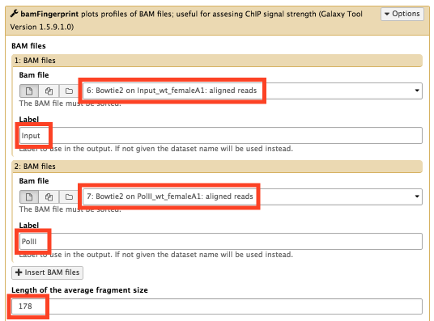

Leave the other settings at their defaults and click *Execute*.

In essence, the plot shows the relative concentration of reads from the two samples mapping to randomly-sampled regions of the genome.
Reads that are uniformly distributed over the genome will generate a straight diagonal line.
On the other hand, if many reads map to only a few, narrow regions, the line will show a sharp rise on the right.


## 8. Generating a signal track

Next we'll generate a signal track comparing the treated sample to the control using the [bamCompare](https://github.com/fidelram/deepTools/wiki/Normalizations#bamCompare) tool.
This tool partitions the genome into equal-sized bins, then computes the relative enrichment of the treatment versus the control for each bin.
Note that there are other, and possibly more sophisticated, ways of generating signal tracks (e.g. peak calling and background comparison with MACS).
So long as they're in bigWig or bedgraph format, signal tracks generated by other tools can be used in the deepTools analysis that we'll perform in the next few steps.

In the tool pane, select *NGS: deepTools > bamCompare*.
Use the following settings:

* First BAM file (e.g. treated sample): **Pol II sample aligned reads**
* Second BAM file (e.g. control sample): **Input sample aligned reads**
* Length of the average fragment size: **178**

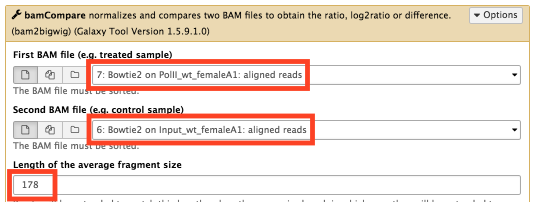

Scroll down a bit and set "Show advanced options" to **yes**, then set "Ignore duplicates" to **Yes**.

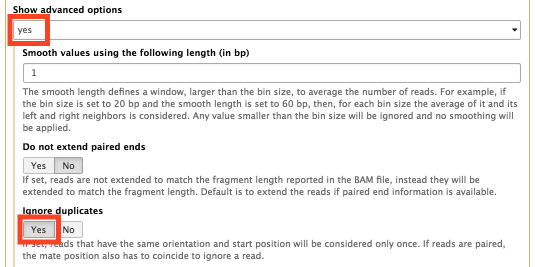

Leave the other settings at their defaults and click *Execute*.


## 9. Comparing chr2L and chrX

Now we'll compare the binding of Pol II to genes on chr2L and chrX.
In the last step, we generated a Pol II vs. input signal track over the entire genome.
We'll partition the genome into regions of interest, considering genes on chr2L and chrX separately, analyze the signal over these regions, and plot the results.


### 9a. Crunching the numbers

In the tool pane, select *NGS: deepTools > computeMatrix*.
Click the *Insert regions to plot* button to add a second region, and use the following settings:

* 1: regions to plot > Regions to plot: **chr2L genes**
* 1: regions to plot > Label: **chr2L**
* 2: regions to plot > Regions to plot: **chrX genes**
* 2: regions to plot > Label: **chrX**
* Score file: **bamCompare signal track**

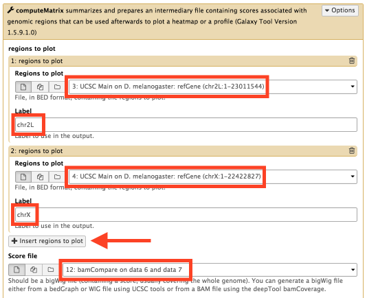

Next, scroll down to where it says "computeMatrix has two main output options" and make sure **scale-regions** is selected.
Use the following settings:

* Distance in bp to which all regions are going to be fitted: **3000**
* Set distance up- and downstream of the given regions: **yes**
* Distance upstream: **1000**
* Distance downstream: **1000**

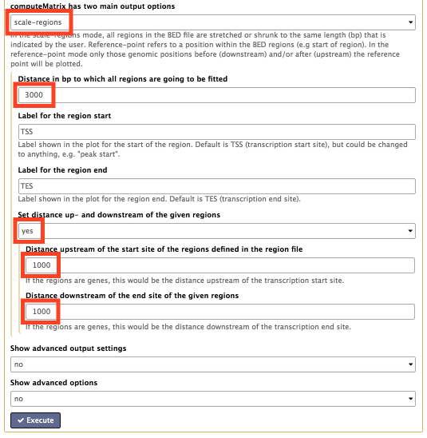

Then click *Execute*.

We'll be running computeMatrix again later using the concatenated genes dataset, so we'll rename this output before we continue.
Wait for the job to finish, click the pencil icon, and name it something like **computeMatrix (chr2L, chrX separate)**.


### 9b. Plotting the heat map

In the tool pane, select *NGS: deepTools > heatmapper*.
Under "Matrix file from the computeMatrix tool", select the **computeMatrix (chr2L, chrX separate)** dataset from the previous step.
Leave the other settings at their defaults.

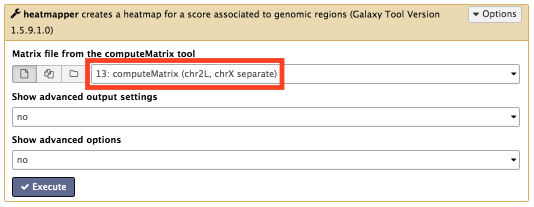

Finally, click *Execute*.

In the previous step, we used the RefSeq genes on chr2L and chrX that we downloaded earlier to define the regions of interest.
We also configured computeMatrix to include 1000 bp upstream and downstream of the gene bodies as part of those regions.
The "scale-regions" mode of computeMatrix scales the regions to a common length, which we set to 3000 bp.

The resulting plots include a signal profile over the regions and two heatmaps, one for chr2L and one for chrX.
Each line in the heatmap represents a single gene and its flanking regions, scaled to the common length.
The colors represent the strength of the signal.
By default, the regions are sorted from top to bottom in decreasing order of the mean signal strength.
Sort order and quantities other than the mean can be selected in the heatmapper tool's advanced options.

Note that the heatmapper tool can save the data underlying the heatmap, too.
We'll see how to do that in the next step.


## 10. Comparing clusters

Next we'll see if we can cluster genes based on Pol II's affinity for binding to them.
The heatmapper tool can only perform clustering when one set of regions is supplied to computeMatrix, which is why we concatenated the chr2L and chrX BED files earlier.


### 10a. Crunching the numbers again

In the tool pane, select *NGS: deepTools > computeMatrix*.
Use the following settings:

* 1: regions to plot > Regions to plot: **concatenated chr2L and chrX genes**
* 1: regions to plot > Label: **genes**
* Score file: **bamCompare signal track**

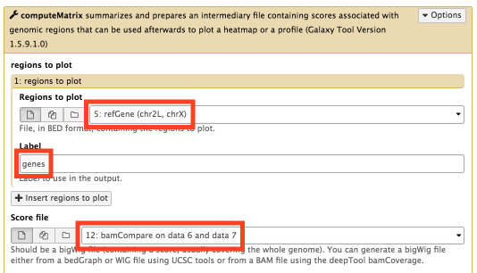

Next, scroll down to where it says "computeMatrix has two main output options" and make sure **scale-regions** is selected.
Use the following settings:

* Distance in bp to which all regions are going to be fitted: **3000**
* Set distance up- and downstream of the given regions: **yes**
* Distance upstream: **1000**
* Distance downstream: **1000**

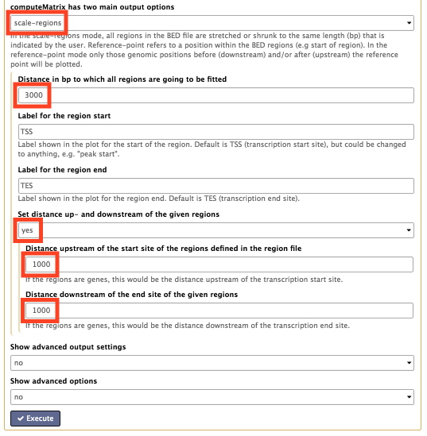

Then click *Execute*.

As before, we'll rename this computeMatrix output so we can distinguish it from the one produced earlier.
Wait for the job to finish, click the pencil icon, and name it something like **computeMatrix (chr2L, chrX combined)**.


### 10b. Plotting the heat map

In the tool pane, select *NGS: deepTools > heatmapper*.
Use the following settings:

* Matrix file from the computeMatrix tool: **computeMatrix (chr2L, chrX combined)**
* Show advanced output settings: **yes**
* Save the regions after skipping zeros or min/max threshold values: **Yes**
* Show advanced options: **yes**

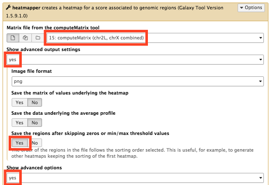

Next, scroll down to the bottom of the advanced options and use the following settings:

* Did you compute the matrix with more than one groups of regions?: **No, I used only one region.**
* Clustering algorithm: **Kmeans clustering**
* Number of clusters to compute: **3**

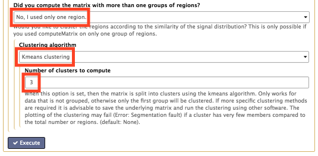

Finally, click *Execute*.

As before, the resulting plots include a signal profile and heatmaps.
This time the regions are grouped into three clusters instead of being separated by chromosome.

Additionally, because we configured the heatmapper tool to save the regions, the heatmapper tool will output a second dataset called "sorted/filtered regions".
This dataset is a BED file that can be used for analyzing results (e.g. in Excel or R), and contains the following columns:

1. chromosome name
1. starting position
1. ending position
1. feature name (in this case, gene name)
1. score (in this case, mean signal over the region)
1. strand
1. assigned cluster
